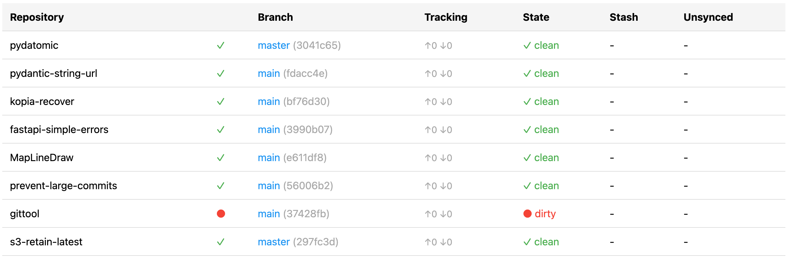

# gittool

Show status information of multiple Git repositories in a folder.

## Introduction

**gittool** is a simple Python script that shows status information of multiple Git repositories
in a browser window. For all repositories in a folder it will show a table with the following
information:
* folder name
* repository overall sync status (red dot or green checkmark): will show a green checkmark if
  working directory is clean, all branches are synced, and no stashes are present
* current branch
* curent branch sync status: ahead/behind
* working directory status: clean or dirty
* number of stashes
* number of unsynced branches (branches without remote or where remote is ahead/behind)

It is available for **Windows**, **macOS** and **Linux**.



## Requirements

You need to have [Git](https://git-scm.com/) and [Python](https://www.python.org/) (>= 3.9)
installed on your system. Additionally you need to install the Python package `aiohttp`,
typically by running

```
pip install aiohttp
```

Depending on your system, you might need to install it with `python -m install aiohttp` or
`python3 -m install aiohttp`. Make sure that running `python -c "import aiohttp"` or
`python3 -c "import aiohttp"` results in no error.

## Installation

Clone this repository to any desired location on your computer:

```
git clone https://github.com/patrsc/gittool.git
```

Then follow the operation-system specific steps:

### Windows

In the file `start.vbs`, edit the `gittool_path` variable to be the full path to the location of
the directory where you cloned `gittool` to, e.g. `"C:\Users\john\Documents\gittool"`, without
a trailing backslash.

You might also need to change the `python_path` variable to either `python3` or the full path to
the python executable. You can get it in Command Prompt by running `where python` or
`where python3`.

Then copy `start.vbs` to any folder where some git repositories are contained (you can copy it to
multiple folders). Run it by double-clicking. A browser window showing the status of repositiories
in that folder will open.

### macOS

In the file `start.applescript`, edit the `gittool_path` variable to be the full path to the location of
the directory where you cloned `gittool` to, e.g. `"/Users/john/Documents/gittool"`, without
a trailing slash.

You might also need to change the `python_path` variable to either `python` or the full path to
the python executable. You can get it in Terminal by running `which python` or
`which python3`.

Open `start.applescript` by double-clicking on it, which will open **AppleScript Editor**, if
you haven't already done so. Click on **File**, **Export** and select **App** as file format.
Export the application to the `gittool` folder, it will get the name `start.app`.

Then copy `start.app` to any folder where some git repositories are contained (you can copy it to
multiple folders). Run it by double-clicking. A browser window showing the status of repositiories
in that folder will open.

### Linux

In the file `start.sh`, edit the `gittool_path` variable to be the full path to the location of
the directory where you cloned `gittool` to, e.g. `"/home/john/Documents/gittool"`, without
a trailing slash.

You might also need to change the `python_path` variable to either `python` or the full path to
the python executable. You can get it in Terminal by running `which python` or
`which python3`.

Then copy `start.sh` to any folder where some git repositories are contained (you can copy it to
multiple folders). Run it by double-clicking. A browser window showing the status of repositiories
in that folder will open.

> [!NOTE]  
> If the script doesn't run, but opens a text editor, open any folder in the **Files** application,
> click on the three bars menu `☰` in the top right corner, select **Preferences** and go to the
> **Behavior** tab, under **Executable Text Files** select **Run them** and close
> the Preferences window.
